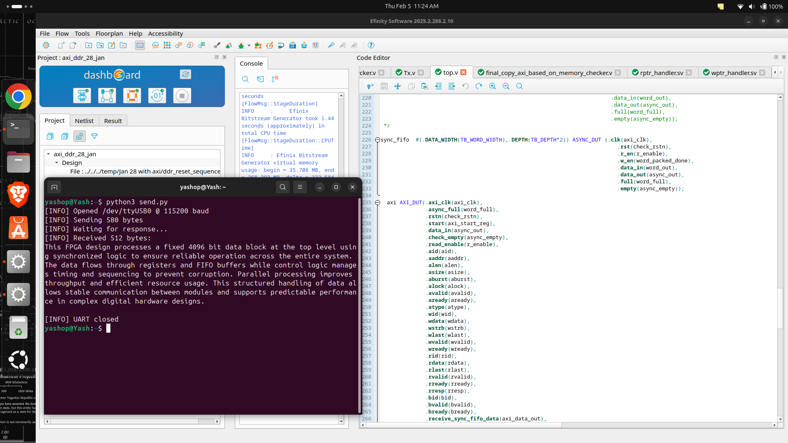

# AXI UART DDR Loopback

This repository implements a UART to DDR memory loopback pipeline using Verilog RTL.  
The design safely transfers low-speed serial UART data into high-speed DDR memory using FIFOs, byte-to-word packing, and an AXI interface, then reads the data back and transmits it over UART.

The system demonstrates reliable clock-domain crossing, data width adaptation, and high-throughput memory transactions using AXI.

---

## System Description

The design receives serial data from a UART interface, buffers it, and converts the byte-wide stream into wide memory words suitable for DDR access.  
These words are written into DDR memory through an AXI interface.  
During the readback phase, the data is fetched from DDR, unpacked into bytes, and transmitted back through the UART.

This architecture enables safe and efficient transfer between low-speed serial interfaces, intermediate FIFO buffering stages, and high-bandwidth DDR memory.

---

## Repository Structure

axi-uart-ddr-loopback/

- UART_RX/ : UART receiver module
- UART_RX_WITH_SYNC_FIFO/ : UART receiver integrated with synchronous FIFO
- Synchronous_fifo/ : Single-clock FIFO for buffering
- Asynchronous_fifo/ : Dual-clock FIFO for clock-domain crossing
- SYNC_WITH_PACKER/ : FIFO connected to byte-packer
- PACKER_TO_ASYNC_FIFO/ : Byte-to-word packing logic
- ASYNC_TO_AXI/ : AXI interface for DDR read and write
- README.md : Project documentation

---

## Module Descriptions

### UART_RX
Receives serial UART data and converts it into 8-bit parallel bytes.

### UART_RX_WITH_SYNC_FIFO
Combines the UART receiver with a synchronous FIFO to buffer incoming data and handle speed mismatches.

### Synchronous_fifo
Single-clock FIFO used between modules in the same clock domain.

### Asynchronous_fifo
Dual-clock FIFO used for safe clock-domain crossing between UART and AXI or DDR domains.

### SYNC_WITH_PACKER
Intermediate stage connecting the synchronous FIFO to the byte-to-word packer.

### PACKER_TO_ASYNC_FIFO
Collects multiple 8-bit UART bytes and packs them into wider memory words suitable for DDR transactions.

### ASYNC_TO_AXI
Implements the AXI interface for DDR memory access, handling read and write bursts.

---

## Data Handling Strategy

Incoming UART data is processed one byte at a time and buffered in FIFOs.  
A packing stage groups multiple bytes into a wide memory word that matches the DDR interface width.  
The AXI interface performs burst transfers to maximize throughput.  
During readback, the data is unpacked into bytes and transmitted over UART.

---

## Clock Domains

The system contains at least two clock domains:

- UART clock domain for serial communication
- AXI or DDR clock domain for memory transactions

Asynchronous FIFOs are used to safely transfer data between these domains.

---

## Key Design Challenges

### DDR Reset Sequencing
The DDR controller required strict reset timing. Incorrect sequencing prevented proper initialization.

### AXI Handshake Management
Read and write operations initially failed due to incorrect valid and ready signaling.  
This was resolved by correctly implementing AXI handshake logic.

### Data Alignment
Misalignment between the packer and AXI interface caused incorrect memory writes.  
The issue was fixed by correcting packing counters and word boundaries.

### Simulation vs Hardware Differences
The design worked in simulation but initially failed on hardware due to reset timing and handshake behavior.

---

## Simulation

Simulate the modules or the integrated pipeline using a Verilog simulator.

Typical steps:

Compile the design files.  
Run the simulation.  
Inspect waveforms to verify UART reception, FIFO transfers, packing, AXI transactions, and loopback behavior.

---

## Simulation Result

The design was also validated on hardware using the Vicharak Vaaman FPGA board with onboard DDR memory, confirming correct end-to-end UART to DDR loopback operation.

---

## Hardware Implementation

1. Integrate the AXI interface with the target DDR controller.
2. Apply correct DDR reset sequencing.
3. Configure UART baud rate and system clocks.
4. Program the FPGA and test loopback through the UART interface.
